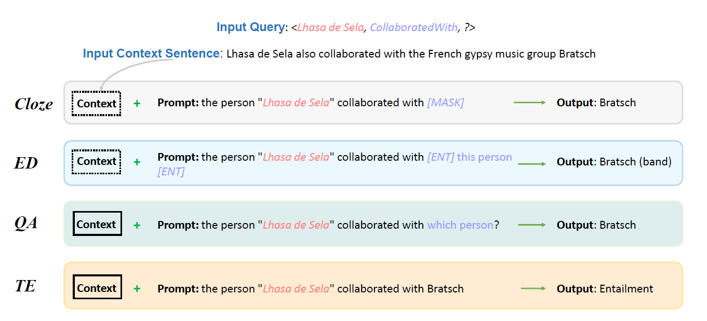

# Knowledge Base Completion for Long-Tail Entities
Recent work has shown that pre-trained language models store a large number of relational facts, and then propose "Language Models as Knowledge Bases" [1].  
Existing approaches use cloze-style prompts to query masked language models.
However, they cannot cope with multi-token facts well and suffer from the long-tail issue.

