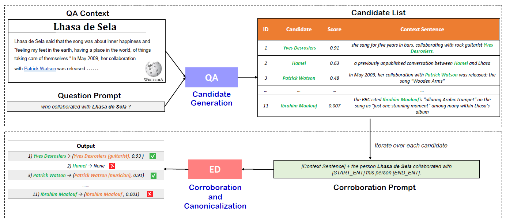
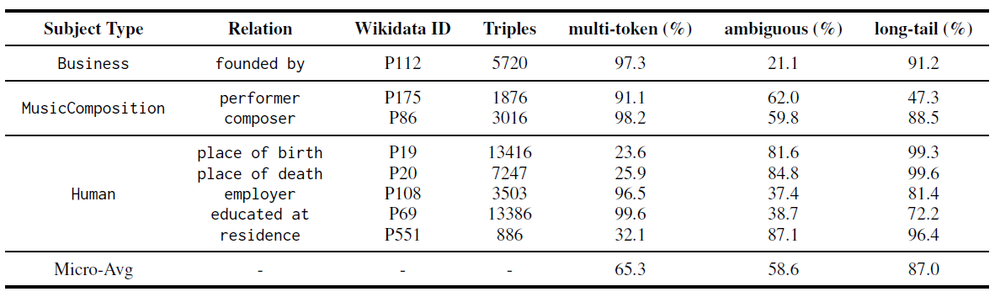

# Knowledge Base Completion for Long-Tail Entities
In this [paper](https://arxiv.org/pdf/2306.17472.pdf), we propose an unsupervised framework for knowledge base completion and a new dataset named [MALT](https://www.mpi-inf.mpg.de/departments/databases-and-information-systems/research/knowledge-base-recall/lm4kbc/malt) for evaluation. The main benefits of our approach are:
* **fully prompt-based**. To extract a new relation, the only thing needed in this framework is to design a prompt.
* **can deal with multi-token and ambiguous entities**
* **work well on long-tail entities**

<p align="center">

</p>
Our method employs two different LMs in a two-stage pipeline as shown in the above Figure. 
The first stage generates candidate answers to input prompts and gives cues to retrieve informative sentences from Wikipedia and other sources. 
The second stage validates the candidates and disambiguates the retained answer strings onto entities in the underlying KG (e.g., mapping “Yves Desrosiers” to Yves Desrosiers (guitarist)).

## Usage
The repo structure is shown below. The `two_stage_pipeline.py` file is the code of our two-stage framework, the [GENRE](https://github.com/facebookresearch/GENRE) path is a submodule that for the corroboration step, and the `data` path contains the MALT dataset
```
ROOT:.
¦   candidate_generation.py
¦   corroboration.py
¦   evaluate.py
¦   LICENSE
¦   README.md
¦   template.py
¦   two_stage_pipeline.py
¦   utils.py
¦   
+---GENRE
¦
+---data
¦       entity_name_qid.txt
¦       gold_wikidata.json
¦       malt_eval.txt
¦       malt_hold_out.txt
¦       wikipedia.json
¦
+---figure
¦       framework.png
¦       malt.png
¦       prompt.png
¦       
```
### Data Preparation
We developed a new dataset with an emphasis on the long-tail challenge, called [MALT](https://www.mpi-inf.mpg.de/departments/databases-and-information-systems/research/knowledge-base-recall/lm4kbc/malt)) (for “Multi-token, Ambiguous, Long-Tailed facts”).
After downloading, put the MALT file in the root path.
There are five files in the MALT dataset:
* `malt_eval.txt` contains entity IDs for evaluation
* `malt_hold_out.txt` contains entity IDs for adjusting the hyper-parameters
* `gold_wikidata.json` contains the gold facts
* `wikipedia.json` contains the corresponding Wikipedia pages
* `entity_name_qid.txt`
  
The below table shows the stats of the MALT dataset, which contains many multi-token, ambiguous, and long-tail facts.
<p align="center">

</p>

### Run Example
Given the input document: 
> Lhasa de Sela said that the song was about inner happiness and
"feeling my feet in the earth, having a place in the world, of things
taking care of themselves.“ In May 2009, her collaboration
with Patrick Watson was released.

We'd like to extract the collaborators for the singer "Lhasa de Sela".
```python
python two_stage_pipeline.py -run_example True
```
After, the output is shown below:
> ( Lhasa de Sela, collaborator, Patrick Watson, 0.4763992584808626 ) <br />
> ( Lhasa de Sela, collaborator, Patrick Watson (musician), 0.3224404241174992 ) <br />
> ( Lhasa de Sela, collaborator, Patrick Watson (producer), 0.2401321410226018 ) <br />
### Run MALT

```python
python two_stage_pipeline.py -run_example False
```
After, you can get two files:
* `extracted_facts.txt` stores the facts extracted by our framework
* `score.txt` stores the evaluation scores (precision, recall, and f1)

## Acknowledgements
*This work was partially funded by ANR-20-CHIA0012-01 (“NoRDF”).*

## License
The MALT dataset is licensed under [CC BY-SA 4.0](https://creativecommons.org/licenses/by-sa/4.0/) and the code is licensed under the MIT license
